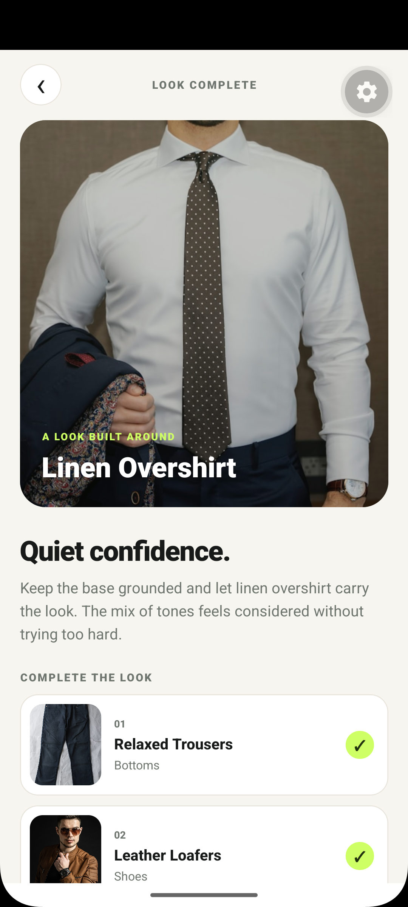
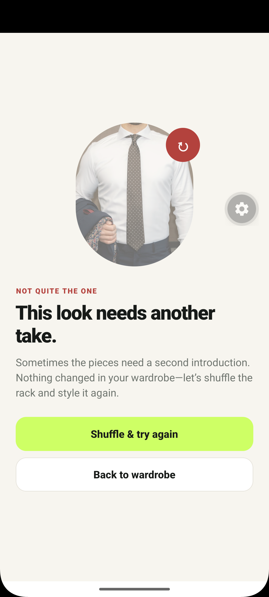

# Drape — Wardrobe & AI Styling Demo

Drape is an Expo/React Native take-home app for organizing a wardrobe, generating an asynchronous outfit recommendation, booking a stylist, and chatting locally.

## What is included

- Mock sign-in/account creation with a persisted local session
- Two-column wardrobe grid with category filters
- Camera and photo-library import with category tagging
- 6.5-second recommendation job with staged status copy, animated progress, a 20% random failure rate, retry handling, and a complete-look result
- Stylist browsing, slot selection, persistent booking, and removal of booked slots
- Local chat with sender-specific bubbles and scroll-to-latest behavior

The recommendation result includes a **Preview failure state** action. This is intentionally included so reviewers can reliably inspect and record the error UI without repeatedly waiting for the random 20% failure.

## Screenshots

**Meaningful loading**



**Recommendation result**


**Recoverable error**



## Setup

Requirements:

- Node.js 20+
- npm
- Expo Go on a physical device, or an Android/iOS simulator

Install and start:

```bash
npm install
npm start
```

Then press `a` for Android, `i` for iOS, or scan the QR code with Expo Go.

Useful checks:

```bash
npm run typecheck
npm run doctor
```

## Demo path

1. Sign in with any valid-looking email and any password of 4+ characters.
2. Tap a wardrobe item, then **Get a recommendation**.
3. Observe the changing status, animated item, progress bar, and timing guidance.
4. On success, review the proposed look and its wardrobe pairings.
5. Tap **Preview failure state**, wait for the simulated job, then test **Try again**.
6. Use the bottom tabs to book a stylist slot and send a chat message.

## Async implementation

The try-on screen models the request as an explicit state machine:

- `loading`: a 6.5-second simulated background job advances capped progress and changes its status message at meaningful milestones.
- `success`: progress completes before the result swaps in, preventing an abrupt transition. Recommendations are selected from other wardrobe categories.
- `error`: approximately 20% of attempts fail. The user gets a plain-language explanation and can retry the entire job.

Timers and the loading animation are cleaned up when the screen unmounts. A production implementation would replace the timer with a create-job endpoint followed by polling or server push, persist the job ID, and allow the user to leave while work continues.

## Assumptions and trade-offs

- Authentication is intentionally local because auth polish is not the focus.
- Wardrobe additions, the login session, and booked slots persist with AsyncStorage. Chat messages are local for the current app session.
- Remote Unsplash images seed the demo, so displaying those initial items requires a network connection. User-added images remain local.
- The “AI result” reuses the selected item as a visual placeholder and applies category-aware local pairing logic.
- The assignment’s priority order was followed: the wardrobe and recommendation paths received the most state and UI treatment; stylist booking and chat are deliberately smaller.
- No backend, realtime messaging, payment, account creation, image upload service, or signed build is included.

## Project structure

```text
src/
  context/       Shared session, wardrobe, and booking state
  navigation/    Root stack and bottom tabs
  screens/       Feature screens
  data.ts        Mock wardrobe, stylist, and chat data
  types.ts       Shared domain and navigation types
  ui.tsx         Shared visual tokens and primitives
```
